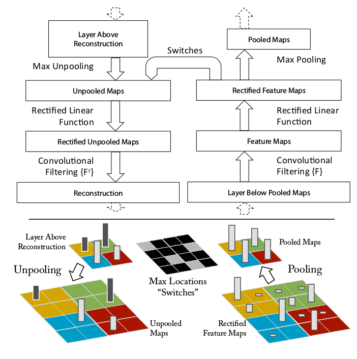

# cv-papers-reading
This is a schedule and brief info about papers I read.

- [x] [ImageNet Classification with Deep Convolutional Neural Networks](#alexnet)

- [x] [Visualizing and Understanding Convolutional Networks](#zfnet)

- [ ] [Very Deep Convolutional Networks for Large-Scale Image Recognition]()

- [ ] [Going deeper with convolutions]()

- [x] [Deep Residual Learning for Image Recognition](#resnet) 

- [ ] [ Rich feature hierarchies for accurate object detection and semantic segmentation]()

- [ ] [Fast R-CNN]()

- [x] [Faster R-CNN: Towards Real-Time Object Detection with Region Proposal Networks](#fasterrcnn) 

- [ ] [ You only look once: Unified, real-time object detection]()

- [ ] [ SSD: Single Shot MultiBox Detector]()

- [ ] [Fully convolutional networks for semantic segmentation]()

- [ ] [Semantic Image Segmentation with Deep Convolutional Nets and Fully Connected CRFs ]()

- [ ] [ Mask R-CNN]()

- [ ] [R-FCN: Object Detection via Region-based Fully Convolutional Networks]()

### [ImageNet Classification with Deep Convolutional Neural Networks](https://papers.nips.cc/paper/4824-imagenet-classification-with-deep-convolutional-neural-networks.pdf) 

**Brief:** This paper is the kick-off for deep learning, from where all it started. Before this, there is no significant use of deep learning because they did not think it is the power horse for computer vision and other areas. Unavailability of computing power is a major drawback, lagged use of NNs. Because Neural Networks are computational hungry, they need to compute the addition and multiplication billions of times. Unavailability of the large labelled dataset is also the one reasons for slow progression in deep learning. Until the ImageNet(which consists of over 15 million labelled high-resolution images in over 22,000 categories) dataset arrived in, there are only datasets with hundreds and thousands of images. MNIST is the most experimented image dataset till then, and other datasets like CIFAR-10/100 and Caltech-101/256 are also available but are high resolution and realistic. AlexNet is trained on 1.2M images with 1000 categories, a subset of ILSVRC 2010 release. They achieved the top1 error of 37.5% and top5 error of 17%, which is a significant reduction compared to state of the art at that time. They said this research is only possible with current GPUs and we can do better research while waiting for the better GPUs. They used only two NVIDIA GTX 580 3GB GPUs which took five to six days for training. Overfitting is a severe problem in those time due to lack of large datasets, luckily now we never care about overfitting anymore. Four novel or unusual features of this networks architecture are ReLU Nonlinearity, Use of Multiple GPUs, Local Response Normalization, Overlapping pooling. Deep convolutional neural networks with ReLUs train several times faster than their equivalents with tanh or sigmoid units.Fig1 Dotted line is *tanh* and the solid line is *relu*, it is six-time faster than tanh. A single GTX 580 GPU has only 3GB memory which limits the size of the network. They used two GPUs and spread the network across the two GPUs.The parallelization scheme that employed essentially puts half of the kernels (or neurons) on each GPU, with one additional trick: the GPUs communicate only in certain layers. Similar to *Batch Normalization* we do they days they did *Local Response Normalization* which reduces the error over 1%.  This is the overall architecture of the AlexNet; the network contains eight layers with weights; the first five are convolutional and the remaining three fully-connected. The output of the last fully connected layer is fed to a 1000-way softmax produces a distribution over 1000 class labels. Response-normalization layers follow the first and second convolutional layers. Max-pooling layers, follow both response-normalization layers as well as the fifth convolutional layer. The ReLU non-linearity is applied to the output of every convolutional and fully-connected layer. Reducing the overfitting is also crucial for better performance. Data augmentation with image translations, random cropping, horizontal reflections and altering the intensities of RBG channels are done. Dropout is also used to reduce overfitting. Dropout consists of setting to zero the output of each hidden neuron with probability 0.5. The neurons which are *dropped out* do not contribute to forward pass and back-propagation. AlexNet achieved top-1 and top-5 test error rates of **37.5%** and **17.0%**. In the ILSVRC 2012 competition, AlexNet won the 1st place. They said removing any middle layer results in a loss of 2% for top-1 performance of the network. The performance can be increased, simply with deeper networks..

(Left) Eight ILSVRC-2010 test images and the five labels considered most probable by the model. The correct label is written under each image, and the probability assigned to the correct label is also shown with a red bar (if it happens to be in the top 5). (Right) Five ILSVRC-2010 test images in the first column. The remaining columns show the six training images that produce feature vectors in the last hidden layer with the smallest Euclidean distance from the feature vector for the test image.

### [Visualizing and Understanding Convolutional Networks](https://www.google.com/url?sa=t&rct=j&q=&esrc=s&source=web&cd=&cad=rja&uact=8&ved=2ahUKEwiUgZ7MlqnrAhVJzDgGHa1mCRoQFjABegQIBBAB&url=https%3A%2F%2Farxiv.org%2Fabs%2F1311.2901&usg=AOvVaw0bGZH7N8K2NZ8upuy-gyju)  

**Brief:** This is the paper that answers all your questions, why do convolutional network work better than any other methods. However, there is no clear understanding of why they perform so well or how they might be improved. Some of them tried to explain what is happening inside the network. In this paper, the authors introduced a novel visualization technique that gives insight into the function of intermediate feature layers and the operation of the classifier. As again said, Convolutional Networks (convnets) deliver outstanding performance on more challenging visual classification tasks. The reasons for this are 1) the availability of much larger training sets, with millions of labelled examples; 2) powerful GPU implementations, making the training of very large models practical. Visualizing features to gain intuition about the network is common practice, but mostly limited to the 1st layer where projections to pixel space are possible. Deconvolutional Network (deconvnet) can be thought of as a convnet model that uses the same components (filtering, pooling) but in reverse, so instead of mapping pixels to features does the opposite. To examine a given convnet activation, we set all other activations in the layer to zero and pass the feature maps as input to the attached deconvnet layer. Then we successively (i) unpool, (ii) rectify and (iii) filter to reconstruct the activity in the layer beneath that gave rise to the chosen activation.

*Top: A deconvnet layer (left) attached to a convnet layer (right). The deconvnet will reconstruct an approximate version of the convnet features from the layer beneath. Bottom: An illustration of the unpooling operation in the deconvnet, using switches which record the
location of the local max in each pooling region (colored
zones) during pooling in the convnet.*

Training is similar to AlexNet. One difference is that the sparse connections used in AlexNet layers 3,4,5 (due to the model being split across 2 GPUs) are replaced with dense connections. The model is trained on ImageNet 2012 training set (1.3 million images, spread over 1000 different classes). Each RGB image is preprocessed by resizing to 256*x*256 and then using ten different subcrops. The training for 70 epochs took 12 days on single GTX580 GPU. I highly request the reader to look into the paper for *Feature Visualization*. Feature Visualizations for each layer is shown in the paper with clear explanations. The lower-level layers are learning edges, colours and middle layers learning basic shapes for the object in the image. Final layer learning the whole object in the image. While visualization of a trained model gives insight
into its operation, it can also assist with selecting good architectures in the first place. They reduced the 1st layer filter size from 11*x*11 to 7*x*7 and made the stride of the convolution 2, rather than 4.

*Figure 3. The architecture of our 8 layer convnet model. A 224 by 224 crop of an image (with 3 color planes) is presented as the input. This is convolved with 96 different 1st layer filters (red), each of size 7 by 7, using a stride of 2 in both x and y. The resulting feature maps are then: (i) passed through a rectified linear function (not shown), (ii) pooled (max within 3*x*3 regions, using stride 2) and (iii) contrast normalized across feature maps to give 96 different 55 by 55 element feature maps. Similar operations are repeated in layers 2,3,4,5. The last two layers are fully connected, taking features from the top convolutional layer as input in vector form (6*x*6*x*256 = 9216 dimensions). The final layer is a C-way softmax function, C being the number of classes. All filters and feature maps are square in shape.*

This architecture beating *AlexNet(single model)* by 1.7%(top-5 error), * best-published performance on this dataset*. The ensemble model achieved 14.8%(top-5 error), while the previous was 15.3%(top-5 error). Analysis of vertical translation, scale, rotation with other occlusion sensitivity is also done. The feature generalization is a great part of this paper. With very less training image, the pre-trained model performed very well on other dataset include Caltech 101/Caltech 256, PASCAL VOC. The necessary changes are done to fit with other datasets. On Caltech-256 with only six training examples per image resulted in the SOTA performance and with 60 training examples, it surpassed the best-reported results. Finally showed how the ImageNet trained model could generalize well to other datasets. For Caltech-101 and Caltech-256, the datasets are similar enough that we can beat the best-reported results, in the latter case by a significant margin. An ablation study on the model revealed that having a minimum depth to the network, rather than any individual section, is vital to the model’s performance.

### [Deep Residual Learning for Image Recognition](https://scholar.google.co.in/scholar?oi=bibs&cluster=9281510746729853742&btnI=1&hl=en) 

**Brief:** As Deeper neural networks are becoming challenging to train at that time, Residual Learning pushes and breaks all the SOTA results. It proposes a novel residual learning function instead of learning unreferenced functions. It involves a reformulation in stacking the layers for deeper architectures. In 2015 the best performing model was GoogleNet, which uses Inception modules and stacking them that worked well. As we continue to increase the depth of the models, they are not performing well. Yes, its the problem in 2015. For example, an 18-layer plain network giving better performance than a 34-layer plain network. As we increase the depth, the training error is increasing, and the test is also increasing. So we cannot take it as overfitting. The training error is less for overfitting, and the test error is more compared with less deep networks. . You can observe that a 20-layer network is giving better results than a 56-layer network. The proposed residual learning and shortcut connections proved accuracy gains with an increase in depth.. Shortcut connections are those which skip one or more layers. In this case, shortcut connections do Identity mapping, and their outputs are added to the outputs of stacked layers. They used batch normalization right after each convolution and before activation. They have not used dropout or max out. Absolutely the results are stunning and considered as a breakthrough in deep neural networks for visual recognition tasks.
 Even though plain networks suffered with an increase in depth, ResNets performed showing accuracy gains for increasing depths.They have implemented ResNets with 18,34,50,101,152 layers. ResNet152 giving the best accuracy among all networks With this they won 1st place in ILSVRC & COCO 2015 competitions:   Im-
ageNet detection, ImageNet localization, COCO detection,
and COCO segmentation.

### [Faster R-CNN: Towards Real-Time Object Detection with Region Proposal Networks](https://scholar.google.co.in/scholar?oi=bibs&cluster=16436232259506318906&btnI=1&hl=en)  

**Brief :** This paper proposes a new architectural change in SOTA object detection algorithms. They introduce *Region Proposal Network (RPN)* that shares full-image convolutional features with the detection network, thus enabling nearly cost-free region proposals. Object detection networks depend on region proposal algorithms to hypothesize object locations. This RPN is a convolutional network that simultaneously predicts objects bounds and scores. Before this paper, regions proposal methods to rely on Selective Search (SS) and other inefficient methods. 
. RPNs can predict anchors with different scales and aspect ratios. R-CNN is used mainly to classify the region proposals into object categories and background. Fast R-CNN enables end-to-end detector training on shared convolutional features and
shows compelling accuracy and speed. . In the Faster R-CNN object detection system, there are two modules. The first module is a deep, fully convolutional network that proposes regions, and the second module is the Fast R-CNN detector that uses the proposed regions. The entire system is a single unified network for object detection. A RPN takes an image as input and outputs a set of rectangular object proposals, each with an objectness score. These object proposals are called as *Anchors*. . To generate region proposals, we slide a small network over the convolutional feature map output by the last shared convolutional layer. This small network takes input as n *x* n spatial window of the input convolutional feature map, each sliding window will map to a lower-dimensional feature. This will be used by two fully connected layers --a box-regression layer and a box-classification layer. The maximum number of possible proposals for each location is *k*. The *reg* layer has *4k* outputs encoding the coordinates of *k* boxes. The *cls* layer outputs *2k* scores that estimate the probability of object or not object for each proposal. An important property of this approach is that it is *translation-invariant* , both in terms of the anchors and the function that compute proposals relative to the anchors. If one translates an object in an image, the proposal should translate, and the same function should be able to predict the proposal in either location. The loss function is a combination of *cls* and *reg*. We assign a positive label if the anchor overlap with the ground-truth box or anchor has an Intersection-over-Union (IoU) higher than 0.7 with any ground truth box. A negative label is assigned if it has IoU lower than 0.3 for all ground-truth boxes. . Faster R-CNN has been implemented on PASCAL VOC with *ZFNet* and *VGGNets*. This is very successful in generating high mAP on different combination networks. For the VGG-16 model, this detection system has a frame rate of 5fps on a GPU while SOTA object detection accuracy on PASCAL VOC 2007,2012 and MS COCO datasets with only 300 proposals per image. In ILSVRC and COCO 2015 competitions, Faster R-CNN and RPN are the foundations of the 1st-place winning entries in several tracks.

