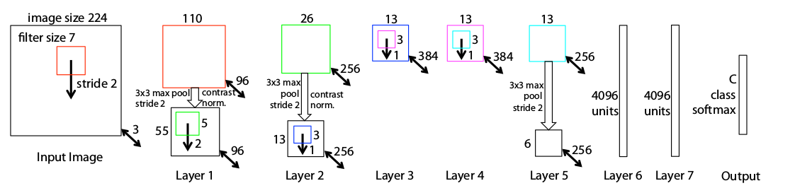
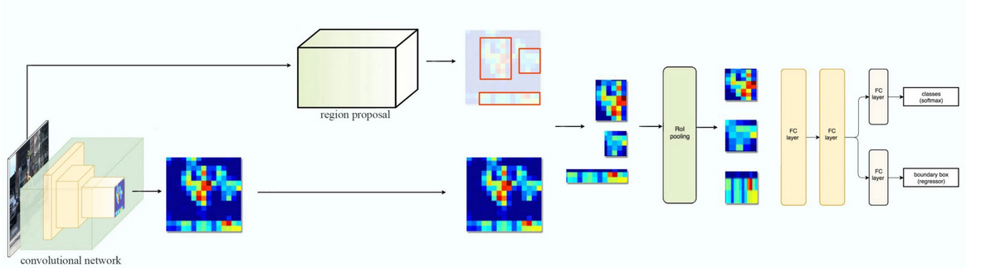
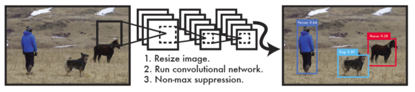

# cv-papers-reading
This repository holds the Brief of cv-papers I read. If you want to have a glimpse of the paper, then you can continue reading this readme. I highly recommend reading papers yourself and get a more in-depth understanding. Click on the title of the paper to go to the paper link. All the papers have been uploaded in their respective folders.

- [ ] [Image Classification]()

    - [x] [ImageNet Classification with Deep Convolutional Neural Networks](#alexnet)

    - [x] [Visualizing and Understanding Convolutional Networks](#zfnet)

    - [x] [Very Deep Convolutional Networks for Large-Scale Image Recognition](#vgg)

    - [x] [Going deeper with convolutions](#googlenet)

    - [x] [Deep Residual Learning for Image Recognition](#resnet) 

    - [ ] [Highway Networks- 2015]()

    - [ ] [Densely Connected Convolutional Networks - 2016]()

    - [ ] [Aggregated Residual Transformations for Deep Neural Networks - 2016]()

    - [ ] [Inception-v4, Inception-ResNet and the Impact of Residual Connections on Learning - 2016]()

    - [ ] [SqueezeNet: AlexNet-level accuracy with 50x fewer parameters and <0.5MB model size - 2016]()

    - [ ] [Wide Residual Networks - 2016]()

    - [ ] [Deep Networks with Stochastic Depth - 2016]()

    - [ ] [Xception: Deep Learning with Depthwise Separable Convolutions]()

    - [ ] [Learning Transferable Architectures for Scalable Image Recognition - 2017]()

    - [ ] [ShuffleNet: An Extremely Efficient Convolutional Neural Network for Mobile Devices - 2017]()

    - [ ] [Squeeze-and-Excitation Networks - 2017]()

    - [ ] [Regularized Evolution for Image Classifier Architecture Search - 2018]()

    - [ ] [MobileNets: Efficient Convolutional Neural Networks for Mobile Vision Applications - 2017]()

    - [ ] [Xception: Deep Learning with Depthwise Separable Convolutions]()

    - [ ] [EfficientNet: Rethinking Model Scaling for Convolutional Neural Networks - 2019]()

    - [ ] [ResNeSt: Split-Attention Networks - 2020]()

- [ ] [Object Detection]()

    - [x] [OverFeat: Integrated Recognition, Localization and Detection using Convolutional Networks](#overfeat)

    - [x] [ Rich feature hierarchies for accurate object detection and semantic segmentation R-CNN](#rcnn)

    - [x] [Fast R-CNN](#frcnn)

    - [x] [Faster R-CNN: Towards Real-Time Object Detection with Region Proposal Networks](#fasterrcnn)

    - [x] [ You only look once: Unified, real-time object detection](#yolov1)

    - [x] [ SSD: Single Shot MultiBox Detector - 2015](#ssd)

    - [ ] [R-FCN: Object Detection via Region-based Fully Convolutional Networks]()

    - [ ] [Focal Loss for Dense Object Detection - 2017]()

    - [ ] [Aggregated Residual Transformations for Deep Neural Networks]()

    - [ ] [Dual Path Networks]()

    - [ ] [CornerNet: Detecting Objects as Paired Keypoints]()

    - [ ] [CenterNet: Keypoint Triplets for Object Detection]()

    - [ ] [Objects as Points]()

    - [ ] [Training-Time-Friendly Network for Real-Time Object Detection]()

    - [ ] [EfficientDet: Scalable and Efficient Object Detection]()

    - [ ] [DetectoRS: Detecting Objects with Recursive Feature Pyramid and Switchable Atrous Convolution]()


- [ ] [Semantic & Instace Segmentation + Pose Estimation]()

    - [ ] [ Mask R-CNN]()

    - [ ] [Fully convolutional networks for semantic segmentation]()

    - [ ] [Semantic Image Segmentation with Deep Convolutional Nets and Fully Connected CRFs ]()

    - [ ] [Stacked Hourglass Networks for Human Pose Estimation]()


    
- [ ] [Popular in Medical Domain]()
    - [ ] [V-Net: Fully Convolutional Neural Networks for Volumetric Medical Image Segmentation - 2016]()


- [ ] [Attetntion and Transformers]()
    - [ ] [Attention Is All You Need - 2017]()
    - [ ] [An Image is Worth 16x16 Words: Transformers for Image Recognition at Scale - 2020]()
    - [ ] [MLP-Mixer: An all-MLP Architecture for Vision - 2021]()
    - [ ] [Patches Are All You Need? - 2022]()


<div id='alexnet'/>

### [ImageNet Classification with Deep Convolutional Neural Networks](https://papers.nips.cc/paper/4824-imagenet-classification-with-deep-convolutional-neural-networks.pdf) 

**Brief:** This paper is the kick-off for deep learning, from where all it started. Before this, there is no significant use of deep learning because they did not think it is the power horse for computer vision and other areas. Unavailability of computing power is a major drawback, lagged use of NNs. Because Neural Networks are computational hungry, they need to compute the addition and multiplication billions of times. Unavailability of the large labelled dataset is also the one reasons for slow progression in deep learning. Until the ImageNet(which consists of over 15 million labelled high-resolution images in over 22,000 categories) dataset arrived in, there are only datasets with hundreds and thousands of images. MNIST is the most experimented image dataset till then, and other datasets like CIFAR-10/100 and Caltech-101/256 are also available but are high resolution and realistic. AlexNet is trained on 1.2M images with 1000 categories, a subset of ILSVRC 2010 release. They achieved the top1 error of 37.5% and top5 error of 17%, which is a significant reduction compared to state of the art at that time. They said this research is only possible with current GPUs and we can do better research while waiting for the better GPUs. They used only two NVIDIA GTX 580 3GB GPUs which took five to six days for training. Overfitting is a severe problem in those time due to lack of large datasets, luckily now we never care about overfitting anymore. Four novel or unusual features of this networks architecture are ReLU Nonlinearity, Use of Multiple GPUs, Local Response Normalization, Overlapping pooling. Deep convolutional neural networks with ReLUs train several times faster than their equivalents with tanh or sigmoid units.Fig1 Dotted line is *tanh* and the solid line is *relu*, it is six-time faster than tanh. A single GTX 580 GPU has only 3GB memory which limits the size of the network. They used two GPUs and spread the network across the two GPUs.The parallelization scheme that employed essentially puts half of the kernels (or neurons) on each GPU, with one additional trick: the GPUs communicate only in certain layers. Similar to *Batch Normalization* we do they days they did *Local Response Normalization* which reduces the error over 1%.  This is the overall architecture of the AlexNet; the network contains eight layers with weights; the first five are convolutional and the remaining three fully-connected. The output of the last fully connected layer is fed to a 1000-way softmax produces a distribution over 1000 class labels. Response-normalization layers follow the first and second convolutional layers. Max-pooling layers, follow both response-normalization layers as well as the fifth convolutional layer. The ReLU non-linearity is applied to the output of every convolutional and fully-connected layer. Reducing the overfitting is also crucial for better performance. Data augmentation with image translations, random cropping, horizontal reflections and altering the intensities of RBG channels are done. Dropout is also used to reduce overfitting. Dropout consists of setting to zero the output of each hidden neuron with probability 0.5. The neurons which are *dropped out* do not contribute to forward pass and back-propagation. AlexNet achieved top-1 and top-5 test error rates of **37.5%** and **17.0%**. In the ILSVRC 2012 competition, AlexNet won the 1st place. They said removing any middle layer results in a loss of 2% for top-1 performance of the network. The performance can be increased, simply with deeper networks..

(Left) Eight ILSVRC-2010 test images and the five labels considered most probable by the model. The correct label is written under each image, and the probability assigned to the correct label is also shown with a red bar (if it happens to be in the top 5). (Right) Five ILSVRC-2010 test images in the first column. The remaining columns show the six training images that produce feature vectors in the last hidden layer with the smallest Euclidean distance from the feature vector for the test image.


<div id='overfeat' />

### [OverFeat: Integrated Recognition, Localization and Detection using Convolutional Networks](https://arxiv.org/abs/1312.6229)  

**Brief:** **OverFeat** is the first paper that described how they did localization and detection. In the ILSVRC2012 competition, AlexNet won both classification and localization, but they did not mention how they did localization. So, In ILSVRC2013, OverFeat won in both localization and detection tasks and given a competitive performance in classification(won by ZFNet in 2013) task. By now, you are confused about what is the difference between localization and detection. I will explain, take a long breath. **Classification**: Classify the object within the image.**Localization**: Classify the objects and localize the objects by bounding boxes within the image.**Detection**: Like localization, we also need to classify the objects and localize the objects by bounding boxes but can contain small objects. The evaluation metric is different from localization. It also needs to predict the background class when there are no objects. OverFeat used the slightly modified version of AlexNet; they made *fast* and *accurate* models. They only difference is filter sizes in the first and second convolutional layers. The changes from AlexNet are there is no local contrast normalization (LRN) and no overlapping pooling. Larger feature maps at 1st and 2nd layers due to the smaller stride of 2. **Multi-Scale Classification** is used to increase the accuracy at inference. The entire image is used in six different scales. At test time, FC layers become 1*x*1 conv layers. The whole image is going into the network, and obtain a class map just like VGGNet.AlexNet obtains 18.2% Top-5 error rate.With **7 fast models + 4 scales + fine stride max-pooling**, the error rate has been greatly reduced to **13.86%**. With **7 accurate models + 4 scales + fine stride max-pooling**, the error rate has been greatly reduced to **13.24%**. We have already seen that different ensembling models will have a significant performance boost. **Fine Stride Pooling** is another technique used after the convolutional layer-5, and I do not want to go into the messy details of that. There is a regression network after the 5th Conv layer, 2 FC layers (4096,1024) and last layer with 4 x C(Classes) are used to predict bounding box coordinates.**Single-class regression (SCR)** and 4 scales achieves **29.9% error rate** in test set and won the **localization** task in **ILSVRC 2013**. For detection, the main difference is the evaluation metric and predicts a background class when there is no object. **OverFeat** also got **24.3% mAP** (mean average prediction) for detection task.Below are some examples of detection. Another technique called **greedy merge algorithm** is used to get the final bounding box.  


<div id='zfnet' />

### [Visualizing and Understanding Convolutional Networks](https://www.google.com/url?sa=t&rct=j&q=&esrc=s&source=web&cd=&cad=rja&uact=8&ved=2ahUKEwiUgZ7MlqnrAhVJzDgGHa1mCRoQFjABegQIBBAB&url=https%3A%2F%2Farxiv.org%2Fabs%2F1311.2901&usg=AOvVaw0bGZH7N8K2NZ8upuy-gyju)  

**Brief:** This is the paper that answers all your questions, why do convolutional network work better than any other methods. However, there is no clear understanding of why they perform so well or how they might be improved. Some of them tried to explain what is happening inside the network. In this paper, the authors introduced a novel visualization technique that gives insight into the function of intermediate feature layers and the operation of the classifier. As again said, Convolutional Networks (convnets) deliver outstanding performance on more challenging visual classification tasks. The reasons for this are 1) the availability of much larger training sets, with millions of labelled examples; 2) powerful GPU implementations, making the training of very large models practical. Visualizing features to gain intuition about the network is common practice, but mostly limited to the 1st layer where projections to pixel space are possible. Deconvolutional Network (deconvnet) can be thought of as a convnet model that uses the same components (filtering, pooling) but in reverse, so instead of mapping pixels to features does the opposite. To examine a given convnet activation, we set all other activations in the layer to zero and pass the feature maps as input to the attached deconvnet layer. Then we successively (i) unpool, (ii) rectify and (iii) filter to reconstruct the activity in the layer beneath that gave rise to the chosen activation.

*Top: A deconvnet layer (left) attached to a convnet layer (right). The deconvnet will reconstruct an approximate version of the convnet features from the layer beneath. Bottom: An illustration of the unpooling operation in the deconvnet, using switches which record the
location of the local max in each pooling region (colored
zones) during pooling in the convnet.*

Training is similar to AlexNet. One difference is that the sparse connections used in AlexNet layers 3,4,5 (due to the model being split across 2 GPUs) are replaced with dense connections. The model is trained on ImageNet 2012 training set (1.3 million images, spread over 1000 different classes). Each RGB image is preprocessed by resizing to 256*x*256 and then using ten different subcrops. The training for 70 epochs took 12 days on single GTX580 GPU. I highly request the reader to look into the paper for *Feature Visualization*. Feature Visualizations for each layer is shown in the paper with clear explanations. The lower-level layers are learning edges, colours and middle layers learning basic shapes for the object in the image. Final layer learning the whole object in the image. While visualization of a trained model gives insight
into its operation, it can also assist with selecting good architectures in the first place. They reduced the 1st layer filter size from 11*x*11 to 7*x*7 and made the stride of the convolution 2, rather than 4.

*Figure 3. The architecture of our 8 layer convnet model. A 224 by 224 crop of an image (with 3 color planes) is presented as the input. This is convolved with 96 different 1st layer filters (red), each of size 7 by 7, using a stride of 2 in both x and y. The resulting feature maps are then: (i) passed through a rectified linear function (not shown), (ii) pooled (max within 3*x*3 regions, using stride 2) and (iii) contrast normalized across feature maps to give 96 different 55 by 55 element feature maps. Similar operations are repeated in layers 2,3,4,5. The last two layers are fully connected, taking features from the top convolutional layer as input in vector form (6*x*6*x*256 = 9216 dimensions). The final layer is a C-way softmax function, C being the number of classes. All filters and feature maps are square in shape.*

This architecture beating *AlexNet(single model)* by 1.7%(top-5 error), * best-published performance on this dataset*. The ensemble model achieved 14.8%(top-5 error), while the previous was 15.3%(top-5 error). Analysis of vertical translation, scale, rotation with other occlusion sensitivity is also done. The feature generalization is a great part of this paper. With very less training image, the pre-trained model performed very well on other dataset include Caltech 101/Caltech 256, PASCAL VOC. The necessary changes are done to fit with other datasets. On Caltech-256 with only six training examples per image resulted in the SOTA performance and with 60 training examples, it surpassed the best-reported results. Finally showed how the ImageNet trained model could generalize well to other datasets. For Caltech-101 and Caltech-256, the datasets are similar enough that we can beat the best-reported results, in the latter case by a significant margin. An ablation study on the model revealed that having a minimum depth to the network, rather than any individual section, is vital to the model’s performance.

<div id='vgg'>

### [Very Deep Convolutional Networks for Large-Scale Image Recognition](https://arxiv.org/abs/1409.1556) 

**Brief:** This is the paper that showed depth is very crucial for performance. However, in the previous papers itself, they said increasing the depth will show better performance. Lack of powerful GPUs held increasing depth. Using tiny filters, we can achieve better performance than large filters used in previous papers. A 5*x*5 kernel has the same receptive field as two stacked 3*x*3 filter, and a  7*x*7 kernel has the same receptive field as three stacked 3*x*3 filters. An important contribution from this paper only uses of 3*x*3 filters in the entire Network. The use of small filters significantly reduces the parameters than the large filters. The architecture has a generic configuration and only differ in depth. Network *A* has 11 weight layers(8 Conv, 3 FC layers) and Network *E* has 19 weight layers (16 Conv, 3 FC layers).
The advantage of using more small filter is, we can incorporate more non-linear rectification layers instead of one, which makes the decision function more discriminative. Moreover, we can decrease the no of parameters(let us look at one 7*x*7 vs three 3*x*3 filters, assume both i/p and o/p has the same no.of channels(C)). The output of three 3*x*3 filters has 27Csq parameters, and 7*x*7 has 49Csq parameters. 

```math
3(3^2C^2)= 27C^2,

7^2C^2= 49C^2
``` 

The ILSVRC-2012 dataset (which was used for ILSVRC 2012–2014 challenges). The dataset includes images of 1000 classes and is split into three sets: training (1.3M images), validation (50K images), and testing (100K images with held-out class labels).
Another notable experiment from this research is training at different single-scales  S = 256 and S = 384. For multi-scale, where each training image is individually rescaled by randomly sampling S from a certain range [S_min = 256, S_max = 512]. This is also can be seen as training set augmentation by scale jittering, where a single model is trained to recognise objects over a wide range of scales. Authors mentioned a way for testing, But I am not able to get it perfectly to put it here. This implementation is based on C++ Cafee toolbox but with significant modifications. These networks are trained on 4-NVIDIA Titan Black GPUs that a single net took 2–3 weeks depending on the architecture. While increasing the depth of the Network, the classification error decreases from 11 layers to 19 layers.Scale jittered model-E leads to **top-1 val error 25.5%** and **top-5 val error 8.0%**. In the multi-scale evaluation test images of are size Q = {S − 32, S, S + 32} (where S is the size of the image at training time). The 19 layer model-E produces **top-1 val error 24.8%** and **top-5 val error 7.5%**. We can observe that in multi-scale evaluation, the error further decreases by a good margin.Model-E(19 layer Net) with multi-crop evaluation and dense ConvNet produces still better results,   **top-1 val error 24.4%** and **top-5 val error 7.1%**. An ensemble of Model-D(16 layer) and Model-E(19 layer) with multi-scale evaluation + multi-crop + dense produces still better results than all of the above **top-1 val error 23.7%** and **top-5 val error 6.8%**. Remember that this result is ensemble on two models and other techniques being previously used. This result is very much close with ILSVRC-2014 winner GoogleNet with **top-5 val error 6.7%**. VGG team got second place in the classification task after GoogleNet. Another contribution is vgg publicly released the vgg16 and vgg19 models.


<div id='googlenet'>

### [Going Deeper with Convolutions](https://arxiv.org/abs/1409.4842) 
**Brief:** **GoogLeNet** is the winner of **ILSVRC2014** image  classification challenge. It showed significant improvement from the previous AlexNet(Winner ILSVRC2012), ZFNet(Winner ILSVRC2013) and little less error from the VGGNet(runner up in ILSVRC2014 classification challenge). 
This network is quite different from AlexNet, ZFNet, VGGNet. It has 1*x*1 convolutions in the middle of the network and Global Average Pooling at the end of the network instead of fully connected layers. These techniques are presented in another paper *Network In Network*. The inception module is having different sizes of convolutions for the same input and concatenating all outputs. Inception word is taken from the famous internet meme *We Need to Go Deeper* . In GoogleNet, the use of 1*x*1 convolution is used as a dimension reduction module to reduce the computation and introduce the non-linearty. The use of 1*x*1 convolution before 3*x*3 and 5*x*5 convolution significantly reduces the number of operations. Inception module having 1*x*1, 3*x*3, 5*x*5, Max pooling layer with 1*x*1 convolution layer and concatenated at the output. Previously Fully Connected(FC) layer is used at the end of the network; All inputs are connected to each output. In GoogLeNet, global average pooling is used at the end of the network by averaging each feature map; this significantly reduces the parameters and increases top-1 accuracy by 0.6%. There are 22-layers in total this is deep model compared to AlexNet, ZFNet. There are several inception modules stacked together to go deeper. As we can see, there are some intermediate softmax branches in the middle that are used only for training. These branches contain Average pooling, Conv, FC, Softmax layers. The loss is added with the total loss with a weight of 0.3. 7 GoogleNet ensembled for prediction.This boosting approach is also used in previous models. Multi-scale testing is used just like VGGNet, with a shorter dimension of 256, 288, 320, 352. (4 scales)Multi-scale testing is used just like VGGNet.Multi-crop testing is used, the same idea but a bit different from and more complicated than AlexNet. A total of (4 scales×3 squares×6 crops×2 versions=144 crops/image)144 crops per image are taken.With 7 models + 144 crops, the **top-5 error is 6.67%**.From this, we can observe that, besides the network design, the other kinds of stuff like ensemble methods, multi-scale and multi-crop approaches are also essential to reduce the error rate. . Finally, GoogLeNet outperforms other previous deep learning networks, and won in ILSVRC 2014.

<div id='rcnn'/>

### [Rich feature hierarchies for accurate object detection and semantic segmentation](https://arxiv.org/abs/1311.2524) 
**Brief:** **R-CNN** is the one of the SOTA(state of the art) CNN based deep learning object detection approaches.  This method combines region proposals
with CNNs, So this method is called R-CNN: Regions with CNN features. Previous progress on various visual recognition tasks has been considerably using SIFT and HOG features. This approach also generalises using a pre-trained model on a large dataset (like AlexNet) and using it for domain/task(like object detection) specific application. This paper shows that usage of CNN can lead to a dramatical increase in performance on PASCAL VOC as compared to HOG features based methods. Usually, CNNs have been used in sliding window fashion with different scales and aspect ratios to detect objects in the image. R-CNN uses a different existing approach called **Selective Search** in a bottom-up fashion to get *Region Proposals*. This method generates around 2000 category-independent region proposals for the input image and extracts a fixed-length feature vector from each proposal using a CNN, and then classifies each region with category-specific linear SVMs.
R-CNN significantly outperforms OverFeat(SOTA on ILSVRC 2013 detection) a mAP of **31.4%** versus **24.3%**.The principal contribution of this paper is to show that supervised pre-training
on a large auxiliary dataset (ILSVRC), followed by domain-specific fine-tuning on a small dataset (PASCAL), is an effective paradigm for learning high-capacity CNNs when data is scarce. This also demonstrates that a simple bounding-box regression method significantly reduces mislocalizations, which are the dominant error mode. This object detection method mainly consists of three modules. The first generates *category-independent region proposals* (selective search’s fast mode). These proposals define the set of candidate detections available to the detector. The second module is a *large convolutional neural network* (used Caffe AlexNet model)that extracts a *4096 fixed-length feature vector* from each region. The third module is a set of *class specific linear SVMs*. After getting scores for all regions, it uses greedy non-max suppression (for each class independently) that rejects a region if it has an intersection-over-union (IoU) overlap with a higher scoring selected region larger than a learned threshold.
 The method with R-CNN BB achieved best performance of **53.7%** mAP on PASCAL VOC 2010 test set. The same method achieves **31.4%** mAP on ILSVRC 2013 detection test set. This super increase in mAP compared to previous best method OverFeat.
.With Fine Tuning + Bounding Box regression on the same model achieved  **58.5% mAP on PASCAL VOC 2007** test set. After using the VGG16 as the pre-trained model + Bounding Box regression, it achieved **66% mAP on VOC 2007 test set**. This method uses different split strategies of available labelled data from Val, test, train. Training data is required for three procedures in R-CNN:(1) CNN fine-tuning, (2) detector SVM training, and (3)bounding-box regressor training. CNN fine-tuning was run for 50k SGD iteration on Val 1 +train N using the same settings as were used for PASCAL. Fine-tuning on a single NVIDIA Tesla K20 took 13 hours using Caffe. There is an interesting relationship between R-CNN and OverFeat: OverFeat can be seen (roughly) as a special case of R-CNN. If one were to replace selective search region proposals with a multi-scale pyramid of regular square regions and change the per-class bounding-box regressors to a single bounding-box regressor, then the systems would be very similar (modulo some potentially significant differences in how they are trained: CNN detection fine-tuning, using SVMs, etc.). R-CNN achieves **mAP of 31.4% on ILSVRC 2013 detection set**. Semantic segmentation is also performed with the same model with some modifications. This method achieved **47.9% Segmaentaion mean accuracy**, It is a 4.2%  over existing O2P(second-order pooling) best method.

<div id='frcnn'/>

### [Fast R-CNN](https://arxiv.org/abs/1504.08083) 

**Brief:**  This paper made the R-CNN work faster in simple words. Fast R-CNN proposes a single-stage training algorithm that jointly learns to classify object proposals and refine their locations. It is an improvement of R-CNN and SPPNet. R-CNN has following drawbacks Training is a multistage pipeline, expensive in space and time, object detection is slow(47s per image with VGG16).R-CNN is slow because it performs a convnet forward pass through each object proposal, without sharing computation.SPPnet computes a conv feature map for the entire image and classifies each object proposal form the feature vector extracted from the shared feature map. Features are extracted for a proposal by max-pooling the portion of the feature map into a fixed-sized output; Multiple output sizes are concatenated into a Spatial Pyramid Pooling.SPPnet accelerates R-CNN by 10 to 100× at test time. Training time is also reduced by 3× due to faster proposal feature extraction. We call this method Fast R-CNN because it is comparatively fast to train and test. Fast R-CNN method has several advantages. 

1. Higher detection quality (mAP) than R-CNN, SPPnet 
2. Training is single-stage, using a multi-task loss 
3. Training can update all network layers 
4. No disk storage is required for feature caching.


A Fast R-CNN network takes input an entire image and set of object proposals(from selective search "quality mode"), the network first processes the whole image with several conv and max-pool layers to produce feature maps. Then each object proposal with Region of Intrest(RoI) pooling layer extracts fixed-length feature vector from the feature map. Each feature vector is fed into a sequence of fully connected layers: one produces K+1 softmax class probabilities and another with 4 values(r, c, h, w) representing a bounding box.


RoI projects and RoI pooling are the most important parts of the paper after that; we will get a fixed size(7*x*7) feature output.Fast R-CNN has a **Multi-task loss** to handle both classification and bounding box regression. Back Propagation is also possible through RoI layers.


In Image classification time taken for computing, FC layers are less compared to Conv layers, But for Detection, it is quite the opposite. Truncated SVD easily accelerates large FC layers. Truncated SVD significantly reduces the computations in FC layers. Three main results from this paper are :

1. SOTA mAP on VOC07,2010 and 2012, 
2. Fast training and testing compared to R-CNN and SPPNet, 
3. Fine Tuning Conv layers in VGG-16 improves mAP.

Tests have been conducted with three models S(AlexNet), M(AlexNet but Wider), L(VGG16). Fast R-CNN achieves a top result on **VOC12 with an mAP of 65.7% (68.4% with extra data)**. On VOC10 Fast R-CNN with data from **VOC07(trainval) + VOC07(test) + VOC12(trainval) achieves a mAP of 68.8%** surpassing segDeepM. On **VOC07 Fast R-CNN achieves mAP of 66.9%**, **training without difficult, marked examples gives mAP of 68.1%** and with **VOC07(trainval) + VOC12(trainval) achieves mAP of 70%**. The main improvement form R-CNN is not mAP but the inference speed. Fast R-CNN took 0.32s/img without truncated SVD and 0.22s/img with truncated SVD while R-CNN took 47s/img and SPPNet took 2.3s/img. Truncated SVD reduces forward pass timing from 320ms/img(mAP 66.9%) to 223ms/img(mAP 66.6%). For MS-COCO dataset Fast R-CNN achieves **PASCAL-style mAP is 35.9%** and new COCO-style AP, which also averages over IoU thresholds, is **19.7%**.

<div id='resnet'/>

### [Deep Residual Learning for Image Recognition](https://scholar.google.co.in/scholar?oi=bibs&cluster=9281510746729853742&btnI=1&hl=en) 


**Brief:** As Deeper neural networks are becoming challenging to train at that time, Residual Learning pushes and breaks all the SOTA results. It proposes a novel residual learning function instead of learning unreferenced functions. It involves a reformulation in stacking the layers for deeper architectures. In 2015 the best performing model was GoogleNet, which uses Inception modules and stacking them that worked well. As we continue to increase the depth of the models, they are not performing well. Yes, its the problem in 2015. For example, an 18-layer plain network giving better performance than a 34-layer plain network. As we increase the depth, the training error is increasing, and the test is also increasing. So we cannot take it as overfitting. The training error is less for overfitting, and the test error is more compared with less deep networks. . You can observe that a 20-layer network is giving better results than a 56-layer network. The proposed residual learning and shortcut connections proved accuracy gains with an increase in depth.. Shortcut connections are those which skip one or more layers. In this case, shortcut connections do Identity mapping, and their outputs are added to the outputs of stacked layers. They used batch normalization right after each convolution and before activation. They have not used dropout or max out. Absolutely the results are stunning and considered as a breakthrough in deep neural networks for visual recognition tasks.
 Even though plain networks suffered with an increase in depth, ResNets performed showing accuracy gains for increasing depths.They have implemented ResNets with 18,34,50,101,152 layers. ResNet152 giving the best accuracy among all networks With this they won 1st place in ILSVRC & COCO 2015 competitions:   Im-
ageNet detection, ImageNet localization, COCO detection,
and COCO segmentation.


<div id='fasterrcnn'/>

### [Faster R-CNN: Towards Real-Time Object Detection with Region Proposal Networks](https://scholar.google.co.in/scholar?oi=bibs&cluster=16436232259506318906&btnI=1&hl=en)  

**Brief :** This paper proposes a new architectural change in SOTA object detection algorithms. They introduce *Region Proposal Network (RPN)* that shares full-image convolutional features with the detection network, thus enabling nearly cost-free region proposals. Object detection networks depend on region proposal algorithms to hypothesize object locations. This RPN is a convolutional network that simultaneously predicts objects bounds and scores. Before this paper, regions proposal methods to rely on Selective Search (SS) and other inefficient methods. 
. RPNs can predict anchors with different scales and aspect ratios. R-CNN is used mainly to classify the region proposals into object categories and background. Fast R-CNN enables end-to-end detector training on shared convolutional features and
shows compelling accuracy and speed. . In the Faster R-CNN object detection system, there are two modules. The first module is a deep, fully convolutional network that proposes regions, and the second module is the Fast R-CNN detector that uses the proposed regions. The entire system is a single unified network for object detection. A RPN takes an image as input and outputs a set of rectangular object proposals, each with an objectness score. These object proposals are called as *Anchors*. . To generate region proposals, we slide a small network over the convolutional feature map output by the last shared convolutional layer. This small network takes input as n *x* n spatial window of the input convolutional feature map, each sliding window will map to a lower-dimensional feature. This will be used by two fully connected layers --a box-regression layer and a box-classification layer. The maximum number of possible proposals for each location is *k*. The *reg* layer has *4k* outputs encoding the coordinates of *k* boxes. The *cls* layer outputs *2k* scores that estimate the probability of object or not object for each proposal. An important property of this approach is that it is *translation-invariant* , both in terms of the anchors and the function that compute proposals relative to the anchors. If one translates an object in an image, the proposal should translate, and the same function should be able to predict the proposal in either location. The loss function is a combination of *cls* and *reg*. We assign a positive label if the anchor overlap with the ground-truth box or anchor has an Intersection-over-Union (IoU) higher than 0.7 with any ground truth box. A negative label is assigned if it has IoU lower than 0.3 for all ground-truth boxes. . Faster R-CNN has been implemented on PASCAL VOC with *ZFNet* and *VGGNets*. This is very successful in generating high mAP on different combination networks. For the VGG-16 model, this detection system has a frame rate of 5fps on a GPU while SOTA object detection accuracy on PASCAL VOC 2007,2012 and MS COCO datasets with only 300 proposals per image. In ILSVRC and COCO 2015 competitions, Faster R-CNN and RPN are the foundations of the 1st-place winning entries in several tracks.


<div id='yolov1'/>

### [You Only Look Once: Unified, Real-Time Object Detection](https://arxiv.org/abs/1506.02640) 

**Brief:** Here comes the fastest object detection algorithm **Y**ou **O**nly **L**ook **O**nce - **YOLO**.It is not only the fastest but also *Unified* and gives *Real-Time Object Detection*. Previous methods use ConvNets to classify region proposals and perform detection. In YOLO detection is performed as a regression problem to spatially separated bounding boxes and associated class probabilities. A single neural network predicts and classifies images in one go. Deformable Parts Model(DPM), OverFeat uses a sliding window approach and R-CNN, Fast R-CNN uses Selective Search(SS) to get region proposals and apply ConvNet on the proposed image. Only Faster R-CNN(Region Proposal Network) is an end-to-end network that can be trained with back-propagation and achieving the maximum accuracy on PASCAL VOC and MS COCO datasets. 

YOLO(24 layers) is extremely fast and runs at **45fps**, and Fast YOLO(Only nine layers) runs at more than **150fps**.YOLO reasons globally while making predictions. YOLO unifies several object detection components into a single network. It divides an Image into S*x*S(7*x*7) grid cells, and these cells are responsible for detecting the object. Each grid cell predicts *B* bounding boxes((2 is used)) with coordinates(*x, y, w, h*) and confidence.

The final output of the network *7 × 7 × (2 ∗ 5 + 20)*(*S × S × (B ∗ 5 + C)*). The Network is similar to GoogLeNet with 24 Conv layers and 2 FC layers, and instead of Inception modules here 1*x*1 reduction layers followed by 3*x*3 conv layers. Fast YOLO has only 9 Conv layers instead of on 24 and fewer filters in those layers.
 
The training is done at 224*x*224, and testing resolution is increased to 448*x*448. The Network trained with 20-Conv layers+avg pool+fc layer on ImageNet for 1-week and achieved top-5 accuracy of **88%**.All height and width are normalized between 0 and 1. **Leaky-Relu** is used in all layers except final layer(linear). Loss Function is designed in such a way that it is optimizing bounding boxes and class probabilities. Non-maximal suppression is used to fix these multiple detections.YOLO struggles with small objects that appear in groups, such as flocks of birds as it imposes strong spatial constraints on bounding box predictions since each grid cell only predicts two boxes and can only have one class. The main source of errors in YOLO is incorrect localizations. YOLO only proposes(98) fewer bounding boxes than R-CNN (~2000 from SS). Fast R-CNN and Faster R-CNN offer speed and accuracy improvements but still fall short of real-time performance. However, only 30Hz DPM runs in real-time(30 fps) but with lower 26.1% mAP. YOLO fine-tuned on VOC07+12 achieves **45fps with a 63.4% mAP**and Fast YOLO achieves **155fps with a 52.7% mAP**. Combing YOLO and Fast R-CNN have a significant boost to performance with **75% mAP on VOC07 test set** and **70.7% mAP on VOC12 test set**. YOLO has generalization ability to perform detections in artwork datasets like People-Art, Picasso Dataset while other methods mAP reduces significantly on these datasets. Implementations are done with **darknet**.

<div id='ssd'/>

#### [SSD: Single Shot MultiBox Detector](https://arxiv.org/abs/1512.02325) 

**Brief :** While the name suggests it only needs a single shot to detect multiple objects in the image.Other previous(R-CNN and succesors) approaches need two shot one for Region Proposal Network and another for detecting object in each region proposal.SSD is much faster, gives real-time performance and is much faster than SOTA methods in object detection. **SSD300 achieves 74.3% mAP at 59FPS** and **SSD500 achieves 76.9% mAP at 22FPS** which outperforms Faster R-CNN (73.2% mAP at 7 FPS) and YOLOv1 (63.4% mAP at 45 FPS). This is the second paper that falls into single-shot detector category.

After going through a certain of convolutions for feature extraction, we obtain a feature layer of size *m×n (number of locations)* with p channels, such as 8×8 or 4×4 above. And a 3×3 conv is applied on this m×n×p feature layer.For each location, we got k bounding boxes For each of the bounding box, we will compute c class scores and 4 offsets relative to the original default bounding box shape.Thus, we got **(c+4)kmn** outputs.

Different feature maps go through a 3*x*3 convolution and 4 or 6 bounding boxes for each location are considered and each bounding box will have (classes+ 4) outputs. Thus, at Conv4_3, the output is 38×38×4×(c+4) considering VOC C=20 and one background class ,it will become 38×38×4×(21+4) = 144,400 . No of bounding boxes are **38x38x4 = 5776**.If we sum up we will get **8732 boxes** in total , it is very low compared to **7x7x2 = 98 for YOLO**. The Loss function is a weighted sum of **confidence** and **localization**.Localization loss is the smooth L1 loss between the predicted box (l) and the ground-truth box (g) parameters. These parameters include the offsets for the center point (cx, cy), width (w) and height (h) of the bounding box. Confidence loss which is the softmax loss over multiple classes confidences (c). Five non-square aspect ratios 1,2,3,1/2,1/3 and one square 1:1 total of 6 bounding boxes in total.For layers with only four boxes ar=3,1/3 are excluded. In all the total boxes most of them are negative boxes , instead of using all we sort them using the highest confidence loss for each default box and pick the top ones so that the ratio between the negatives and positives is at most 3:1. Exhastive data augumentation is used to create more data.The base network is VGG16 and pre-trained using ILSVRC classification dataset. FC6 and FC7 are changed to convolution layers as Conv6 and Conv7.FC6 and FC7 use Atrous convolution instead of conventional convolution.There are two Models: SSD300 and SSD512
1. SSD300: 300×300 input image, lower resolution, faster.
2. SSD512: 512×512 input image, higher resolution, more accurate. 

**Data Augmentation** is crucial, which improves from **65.5% to 74.3% mAP**.**SSD512 has 81.6% mAP** and **SSD300 has 79.6% mAP** on **VOC 2007** which is already better than Faster R-CNN of 78.8%.**SSD512 has 80.0% mAP** and **SSD300 has 77.5% mAP** on **VOC 2012** which is greater than Faster R-CNN with 75.9% mAP and YOLO with 57.9% mAP.**SSD512 is only 1.2%** better than Faster R-CNN in mAP@0.5. This is because it has much better AP (4.8%) and AR (4.6%) for larger objects, but has relatively less improvement in AP (1.3%) and AR (2.0%) for small objects.Preliminary results are obtained on **ILSVRC DET** with **SSD300: 43.4% mAP** is obtained on the val2 set. To overcome the weakness of missing detection on small object as mentioned “zoom out” operation is done to create more small training samples and an increase of 2%-3% mAP is achieved across multiple datasets.

With batch size of 1, SSD300 and SSD512 can obtain 46 FPS and 19 FPS respectively and with batch size of 8, SSD300 and SSD512 can obtain 59 FPS and 22 FPS respectively. This is absolute real-time perfromance with such high accuracies.


## Author

|<a href ="https://github.com/ummadiviany"></a>                                          |
| -------------------------------------------------------------------------------------------------------------------------------------------------- |
| [VINAY UMMADI](https://github.com/ummadiviany)                                                                                                     |