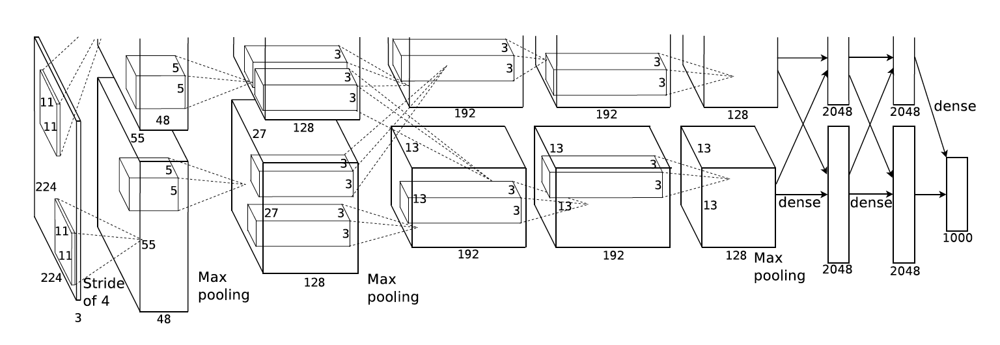

# cv-papers-reading
This is a schedule and brief info about papers I read.

## Conference on Computer Vision and Pattern Recognition

1. [Deep Residual Learning for Image Recognition](https://scholar.google.co.in/scholar?oi=bibs&cluster=9281510746729853742&btnI=1&hl=en) 

**Brief:** As Deeper neural networks are becoming challenging to train at that time, Residual Learning pushes and breaks all the SOTA results. It proposes a novel residual learning function instead of learning unreferenced functions. It involves a reformulation in stacking the layers for deeper architectures. In 2015 the best performing model was GoogleNet, which uses Inception modules and stacking them that worked well. As we continue to increase the depth of the models, they are not performing well. Yes, its the problem in 2015. For example, an 18-layer plain network giving better performance than a 34-layer plain network. As we increase the depth, the training error is increasing, and the test is also increasing. So we cannot take it as overfitting. The training error is less for overfitting, and the test error is more compared with less deep networks. . You can observe that a 20-layer network is giving better results than a 56-layer network. The proposed residual learning and shortcut connections proved accuracy gains with an increase in depth.. Shortcut connections are those which skip one or more layers. In this case, shortcut connections do Identity mapping, and their outputs are added to the outputs of stacked layers. They used batch normalization right after each convolution and before activation. They have not used dropout or max out. Absolutely the results are stunning and considered as a breakthrough in deep neural networks for visual recognition tasks.
 Even though plain networks suffered with an increase in depth, ResNets performed showing accuracy gains for increasing depths.They have implemented ResNets with 18,34,50,101,152 layers. ResNet152 giving the best accuracy among all networks With this they won 1st place in ILSVRC & COCO 2015 competitions:   Im-
ageNet detection, ImageNet localization, COCO detection,
and COCO segmentation.

2. [Going Deeper With Convolutions](https://scholar.google.co.in/scholar?oi=bibs&cluster=17799971764477278135&btnI=1&hl=en)

3. [Fully Convolutional Networks for Semantic Segmentation](https://scholar.google.co.in/scholar?oi=bibs&cluster=16635967164511657165&btnI=1&hl=en)

4. [You Only Look Once: Unified, Real-Time Object Detection](https://scholar.google.co.in/scholar?oi=bibs&cluster=6382612685700818764&btnI=1&hl=en)

5. [Densely Connected Convolutional Networks](https://scholar.google.co.in/scholar?oi=bibs&cluster=4205512852566836101&btnI=1&hl=en)

## International Conference on Computer Vision

1. [Fast R-CNN](https://scholar.google.co.in/scholar?oi=bibs&cluster=16324699838103945745&btnI=1&hl=en)

2. [Delving Deep into Rectifiers: Surpassing Human-Level Performance on ImageNet Classification](https://scholar.google.co.in/scholar?oi=bibs&cluster=6243061688889140249&btnI=1&hl=en)

3. [Mask R-CNN](https://scholar.google.co.in/scholar?oi=bibs&cluster=11459229647356475672&btnI=1&hl=en)

## European Conference on Computer Vision

1. [SSD: Single Shot MultiBox Detector](https://scholar.google.co.in/scholar?oi=bibs&cluster=15383553494348295625&btnI=1&hl=en)

2. [Identity Mappings in Deep Residual Networks](https://scholar.google.co.in/scholar?oi=bibs&cluster=14035416619237709781&btnI=1&hl=en)

3. [Perceptual Losses for Real-Time Style Transfer and Super-Resolution](https://scholar.google.co.in/scholar?oi=bibs&cluster=5132755018694140583&btnI=1&hl=en)

## IEEE Transactions on Pattern Analysis and Machine Intelligence

1. [Faster R-CNN: Towards Real-Time Object Detection with Region Proposal Networks](https://scholar.google.co.in/scholar?oi=bibs&cluster=16436232259506318906&btnI=1&hl=en)  

**Brief :** This paper proposes a new architectural change in SOTA object detection algorithms. They introduce *Region Proposal Network (RPN)* that shares full-image convolutional features with the detection network, thus enabling nearly cost-free region proposals. Object detection networks depend on region proposal algorithms to hypothesize object locations. This RPN is a convolutional network that simultaneously predicts objects bounds and scores. Before this paper, regions proposal methods to rely on Selective Search (SS) and other inefficient methods. 
. RPNs can predict anchors with different scales and aspect ratios. R-CNN is used mainly to classify the region proposals into object categories and background. Fast R-CNN enables end-to-end detector training on shared convolutional features and
shows compelling accuracy and speed. . In the Faster R-CNN object detection system, there are two modules. The first module is a deep, fully convolutional network that proposes regions, and the second module is the Fast R-CNN detector that uses the proposed regions. The entire system is a single unified network for object detection. A RPN takes an image as input and outputs a set of rectangular object proposals, each with an objectness score. These object proposals are called as *Anchors*. . To generate region proposals, we slide a small network over the convolutional feature map output by the last shared convolutional layer. This small network takes input as n *x* n spatial window of the input convolutional feature map, each sliding window will map to a lower-dimensional feature. This will be used by two fully connected layers --a box-regression layer and a box-classification layer. The maximum number of possible proposals for each location is *k*. The *reg* layer has *4k* outputs encoding the coordinates of *k* boxes. The *cls* layer outputs *2k* scores that estimate the probability of object or not object for each proposal. An important property of this approach is that it is *translation-invariant* , both in terms of the anchors and the function that compute proposals relative to the anchors. If one translates an object in an image, the proposal should translate, and the same function should be able to predict the proposal in either location. The loss function is a combination of *cls* and *reg*. We assign a positive label if the anchor overlap with the ground-truth box or anchor has an Intersection-over-Union (IoU) higher than 0.7 with any ground truth box. A negative label is assigned if it has IoU lower than 0.3 for all ground-truth boxes. . Faster R-CNN has been implemented on PASCAL VOC with *ZFNet* and *VGGNets*. This is very successful in generating high mAP on different combination networks. For the VGG-16 model, this detection system has a frame rate of 5fps on a GPU while SOTA object detection accuracy on PASCAL VOC 2007,2012 and MS COCO datasets with only 300 proposals per image. In ILSVRC and COCO 2015 competitions, Faster R-CNN and RPN are the foundations of the 1st-place winning entries in several tracks.

2. [Fully Convolutional Networks for Semantic Segmentation](https://scholar.google.co.in/scholar?oi=bibs&cluster=16635967164511657165&btnI=1&hl=en)

3. [Mask R-CNN](https://scholar.google.co.in/scholar?oi=bibs&cluster=11459229647356475672&btnI=1&hl=en)

4. [ImageNet Classification with Deep Convolutional Neural Networks](https://papers.nips.cc/paper/4824-imagenet-classification-with-deep-convolutional-neural-networks.pdf)

**Brief:** This paper is kick off for deep learning, from where all it started. Before this there is not a significant use of deep learning becasue they didn't thought it is the power horse for computer vision and other areas. Unavialability of computing power is the major drawback, lagged use of NNs. Bcs Neural Networks are computaional hungry they need to compute the addition and multiplication billons of times. Unavailabity of large labeled dataset is also the one reasons for late progression in deep learning. Until the ImageNet(which consitis of over 15 million labeled high-resolution images in over 22,000 categories) dataset arrived in , there are only datasets with hundreds and thousand of images. MNIST is the most experimented image dataset till then, and other datasets like CIFAR-10/100 and Caltech-101/256 are also available but are high resolution and realistic. AlexNet is trained on 1.2M images with 1000 categories ,a subset of ILSVRC 2010 release. They acheived the top1 error of 37.5% and top5 error of 17% which is significant reduction compared to the state of the art at that time. They said this research is only possible with current GPUs and we can do better research while waiting for the better GPUs. They used only two NVIDIA GTX 580 3GB GPUs which took five to six days for training. Overfitting is severe problem in those time due to lack of large datasets , luckily now we never care about overfitting anymore. Four novel or unsual features of this networks architecture are ReLU Nonlinearity, Use of Multiple GPUs, Local Response Normalization, Overlapping pooling. Deep convolutional neural networks with ReLUs train several times faster than their equivalents with tanh or sigmoid units.Fig1 Dotted line is *tanh* and solid line is *relu*, it is six time faster than tanh.A single GTX 580 GPU has only 3GB memory which limits the size of the network. They used two GPUs and spread the network accross the two GPUs.The parallelization scheme that employed essentially puts half of the kernels (or neurons) on each GPU, with one additional trick: the GPUs communicate only in certain layers. Similar to *Batch Normilization* we do they days they did *Local Response Normailization* which reduces the error over 1%.  This is the overall architecture of the AlexNet, the network contains eight layers with weights; the first five are convolutional and the remaining three fully-connected. The output of last fully connected layer is fed to a 1000-way softmax produces distribution over 1000 class labels.Response-normalization layers follow the first and second convolutional layers. Max-pooling layers, follow both response-normalization layers as well as the fifth convolutional layer. The ReLU non-linearity is applied to the output of every convolutional and fully-connected layer. Reduciing the overfitting is also crucial for better performance. Data augmentation with image translations, random cropping, horizantal reflections and altering the intensities of RBG channels are done. Dropout is also used to reduce the overfitting. Dropout consits of setting to zero the ouput of each hiddenn neuron with probability 0.5. The neurons which are *dropped out* do not contribute to forward pass and back-propagation. AlexNet achieved top-1 and top-5 test eroor rates of **37.5%** and **17.0%**. In ILSVRC 2012 competiton , AlexNet won the 1st place. They said removing any middle layer results in a loss of 2% for top-1 performnce of the network. The perfomanc can be increased , simply with deeper networks..(Left) Eight ILSVRC-2010 test images and the five labels considered most probable by our model.
The correct label is written under each image, and the probability assigned to the correct label is also shown
with a red bar (if it happens to be in the top 5). (Right) Five ILSVRC-2010 test images in the first column. The remaining columns show the six training images that produce feature vectors in the last hidden layer with the smallest Euclidean distance from the feature vector for the test image.

## IEEE Transactions on Image Processing

## 